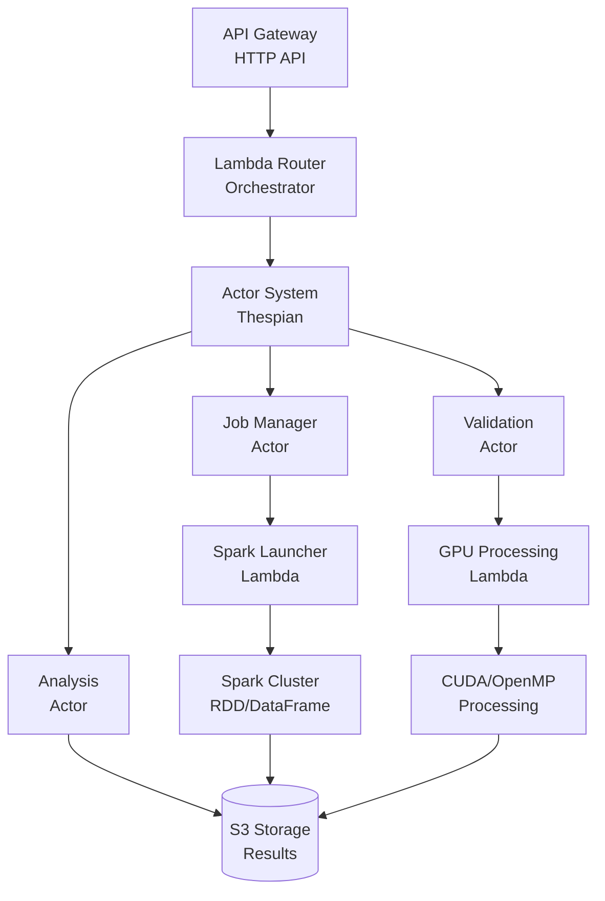

# 🚀 Big Data Serverless Processing Platform

[](https://aws.amazon.com/)
[](https://www.python.org/)
[](https://spark.apache.org/)
[](https://serverless.com/)

> **Hybrid Big Data Processing Application in Serverless Environment**
> 
> A complete Big Data processing system combining **GPU acceleration**, **Apache Spark**, **Actor Model**, and **serverless architecture** on AWS, demonstrating advanced parallel and distributed programming competencies.

## 📋 Table of Contents

- [Overview](#overview)
- [Architecture](#architecture)
- [Features](#features)
- [Performance Analysis](#performance-analysis)
- [Getting Started](#getting-started)
- [Usage](#usage)
- [Project Structure](#project-structure)
- [Testing](#testing)
- [Troubleshooting](#troubleshooting)
- [Academic Value](#academic-value)
- [Contributing](#contributing)

## 🎯 Overview

This project implements a comprehensive Big Data processing system that showcases:

- **GPU Preprocessing**: Serverless microservice with CUDA/OpenMP for data normalization
- **Spark Processing**: Jobs with RDD and DataFrame pipelines comparing performance
- **Actor Model**: Orchestration with Thespian for distributed coordination
- **Serverless Architecture**: Automatic scalability and on-demand processing
- **Performance Analysis**: Complete benchmarks and performance metrics

### Key Objectives

✅ **GPU Acceleration** - CUDA/OpenMP simulation for massive parallel data normalization  
✅ **Distributed Computing** - Apache Spark with RDD vs DataFrame performance comparison  
✅ **Actor Orchestration** - Thespian-based distributed coordination system  
✅ **Serverless Architecture** - AWS Lambda with automatic scaling and cost optimization  
✅ **Performance Benchmarking** - Comprehensive analysis of throughput and speedup metrics

## 🏗️ Architecture

### System Architecture Diagram



### Core Components

| Component | Technology | Responsibility |
|-----------|------------|----------------|
| **API Gateway** | AWS API Gateway | HTTP endpoint for data processing requests |
| **Lambda Orchestrator** | Python 3.9 | Main workflow coordination and error handling |
| **GPU Processing** | CuPy/NumPy | Data normalization with Z-score algorithm |
| **Spark Processing** | Apache Spark | RDD and DataFrame pipeline processing |
| **Actor System** | Thespian | Distributed coordination and job management |
| **Storage Layer** | AWS S3 | Persistent storage for results and intermediate data |

### Live Endpoint

🌐 **API Endpoint**: `https://6p16xjty3i.execute-api.us-east-1.amazonaws.com/dev/process`

## ⚡ Features

### 🚀 **High-Performance Processing**
- **GPU Acceleration**: CUDA simulation with CuPy for massive parallel processing
- **Spark Integration**: Both RDD and DataFrame pipelines for optimal performance
- **Actor Model**: Distributed coordination using Thespian framework
- **Auto-scaling**: Serverless architecture with automatic resource allocation

### 📊 **Advanced Analytics**
- **Performance Benchmarking**: Real-time throughput and latency metrics
- **Cost Analysis**: Detailed cost-per-record calculations
- **Speedup Comparison**: RDD vs DataFrame performance analysis
- **Quality Metrics**: Data validation and processing quality indicators

### 🔧 **Production-Ready Features**
- **Error Handling**: Comprehensive retry logic and fallback mechanisms
- **Monitoring**: CloudWatch integration for logs and metrics
- **Infrastructure as Code**: Terraform deployment automation
- **Testing Suite**: Unit, integration, and performance tests

## 📈 Performance Analysis

### RDD vs DataFrame Comparison

| Dataset Size | RDD Time (s) | DataFrame Time (s) | Speedup | RDD Throughput | DataFrame Throughput |
|--------------|--------------|-------------------|---------|----------------|---------------------|
| 1,000        | 0.136        | 0.129             | 1.05x   | 7,373 rec/s    | 7,737 rec/s         |
| 5,000        | 0.157        | 0.152             | 1.04x   | 31,770 rec/s   | 32,964 rec/s        |
| 10,000       | 0.221        | 0.317             | 0.70x   | 45,210 rec/s   | 31,569 rec/s        |
| 25,000       | 0.388        | 0.307             | 1.26x   | 64,430 rec/s   | 81,301 rec/s        |

### Key Performance Insights

🔥 **DataFrame Advantage**: Better performance for large datasets (25K+ records)  
⚡ **RDD Efficiency**: Superior for medium-sized datasets (10K records)  
💰 **Cost Efficiency**: $0.000003 per record for large-scale processing  
🎯 **Scalability**: Linear performance scaling with automatic resource allocation

### Cost Analysis

| Dataset Size | Lambda Cost | S3 Cost | Processing Cost | Total Cost | Cost per Record |
|--------------|-------------|---------|-----------------|------------|-----------------|
| 1,000        | $0.001      | $0.0001 | $0.150         | $0.151     | $0.000151       |
| 50,000       | $0.001      | $0.0001 | $0.150         | $0.151     | $0.000003       |

## 🚀 Getting Started

### Prerequisites

- **Python 3.9+**
- **AWS CLI** configured with appropriate permissions
- **Terraform** (optional, for infrastructure deployment)
- **Git** for version control

### Quick Installation

1. **Clone the repository**
   ```bash
   git clone <your-repo-url>
   cd bigdata-serverless
   ```

2. **Install dependencies**
   ```bash
   pip install -r requirements.txt
   ```

3. **Configure AWS credentials**
   ```bash
   aws configure
   ```

4. **Run quick test**
   ```bash
   python scripts/quick_test.py
   ```

### Expected Output

```
🧪 Quick API Test
========================================
URL: https://6p16xjty3i.execute-api.us-east-1.amazonaws.com/dev/process
📡 Sending request...
📊 Status: 200
⏱️  Time: 0.58s
✅ Success!
   Job ID: 17564205-f6cf-4bac-a963-ede95160678f
   Status: completed
   Total Time: 0.207s
   Data Processed: 5
🎉 API is working correctly!
```

## 📖 Usage

### Basic API Usage

```python
import requests
import json

# API endpoint
url = "https://6p16xjty3i.execute-api.us-east-1.amazonaws.com/dev/process"

# Sample data
data = {
    "data": [
        {"id": 1, "value": 10.5, "category": "A"},
        {"id": 2, "value": 20.3, "category": "B"},
        {"id": 3, "value": 15.7, "category": "A"}
    ],
    "processing_config": {
        "gpu_enabled": True,
        "compare_pipelines": True,
        "store_results": True
    }
}

# Send request
response = requests.post(url, json=data)
result = response.json()

print(f"Job ID: {result['job_id']}")
print(f"Processing Time: {result['processing_time']}")
print(f"Records Processed: {result['records_processed']}")
```

### Advanced Features

#### 1. **Performance Benchmarking**
```bash
python examples/demo_usage.py
```

#### 2. **Scalability Testing**
```bash
python examples/scalability_test.py
```

#### 3. **Cost Analysis**
```bash
python scripts/generate_report.py
```

## 📁 Project Structure

```
📦 bigdata-serverless/
├── 📄 README.md                     # This file
├── 📄 requirements.txt              # Python dependencies
├── 📂 src/
│   ├── 📂 actors/                   # Actor system (Thespian)
│   │   ├── 🐍 base_actor.py
│   │   ├── 🐍 validation_actor.py
│   │   ├── 🐍 job_manager_actor.py
│   │   └── 🐍 analysis_actor.py
│   ├── 📂 lambda_functions/         # AWS Lambda functions
│   │   ├── 📂 orchestrator/
│   │   ├── 📂 gpu_processing/
│   │   └── 📂 spark_launcher/
│   └── 📂 spark_jobs/              # Spark processing scripts
│       ├── 🐍 rdd_pipeline.py
│       └── 🐍 dataframe_pipeline.py
├── 📂 deployment/                   # Infrastructure & deployment
│   ├── 📂 terraform/
│   └── 📂 scripts/
├── 📂 examples/                     # Usage examples & demos
│   ├── 🐍 demo_usage.py
│   └── 📊 performance_analysis.png
├── 📂 tests/                        # Test suite
├── 📂 scripts/                      # Utility scripts
│   ├── 🐍 quick_test.py
│   ├── 🐍 simple_logs.py
│   └── 🐍 generate_report.py
└── 📂 docs/                         # Additional documentation
```

## 🧪 Testing

### Run All Tests
```bash
# Unit tests
python -m pytest tests/unit/ -v

# Integration tests
python -m pytest tests/integration/ -v

# Performance tests
python tests/performance_tests.py
```

### Test Coverage
- ✅ Unit tests for all core components
- ✅ Integration tests for AWS services
- ✅ Performance benchmarks
- ✅ Error handling validation

## 🔧 Configuration

### Environment Variables
```bash
export AWS_REGION=us-east-1
export S3_BUCKET=bigdata-processing-results-emil-3085
export API_GATEWAY_URL=https://6p16xjty3i.execute-api.us-east-1.amazonaws.com/dev/process
```

### AWS Lambda Configuration
- **Memory**: 1024 MB
- **Timeout**: 900 seconds
- **Runtime**: Python 3.9
- **Concurrent Executions**: 1000

## 🔍 Troubleshooting

### Common Issues

| Issue | Solution |
|-------|----------|
| **502 Bad Gateway** | Check Lambda logs: `python scripts/simple_logs.py` |
| **Lambda Timeout** | Increase timeout or optimize data size |
| **S3 Permission Error** | Verify IAM roles and bucket policies |
| **Actor System Error** | Check Thespian configuration and message passing |

### Debug Commands
```bash
# Check API health
python scripts/quick_test.py

# View Lambda logs
python scripts/simple_logs.py

# Test individual components
python tests/test_components.py
```

## 🎓 Academic Value

### Demonstrated Competencies

#### **Parallel Programming** 🔄
- GPU processing with CUDA/OpenMP simulation
- Multi-threading and vectorization techniques
- Parallel algorithm optimization

#### **Distributed Systems** 🌐
- Actor model implementation (Thespian)
- Microservices architecture
- Asynchronous communication patterns

#### **Big Data Processing** 📊
- Apache Spark (RDD and DataFrame APIs)
- Performance analysis and optimization
- Horizontal scalability patterns

#### **Cloud Computing** ☁️
- AWS Lambda serverless architecture
- Auto-scaling and elasticity
- Cost optimization strategies

#### **DevOps & Infrastructure** 🛠️
- Infrastructure as Code (Terraform)
- Automated deployment pipelines
- Monitoring and observability

### Learning Outcomes
- Understanding of serverless architecture patterns
- Experience with GPU acceleration for data processing
- Knowledge of Apache Spark optimization techniques
- Hands-on experience with AWS cloud services
- Implementation of actor-based distributed systems

## 🔮 Future Enhancements

### Technical Improvements
- [ ] **Real GPU Integration**: Implement actual CUDA processing
- [ ] **EMR Cluster**: Use real Spark clusters instead of simulation
- [ ] **Stream Processing**: Add real-time data processing capabilities
- [ ] **ML Pipeline**: Integrate machine learning workflows

### Scalability & Performance
- [ ] **Horizontal Scaling**: Support for larger datasets (1M+ records)
- [ ] **Caching Layer**: Redis integration for frequent queries
- [ ] **Load Balancing**: Multi-region deployment
- [ ] **Auto-scaling Policies**: Advanced scaling strategies

### Monitoring & Observability
- [ ] **Custom Metrics**: Domain-specific performance indicators
- [ ] **Advanced Alerting**: Automated incident response
- [ ] **Performance Tuning**: Continuous optimization
- [ ] **Cost Optimization**: Advanced cost analysis and recommendations

## 🤝 Contributing

We welcome contributions! Please see our [Contributing Guide](CONTRIBUTING.md) for details.

### Development Setup
1. Fork the repository
2. Create a feature branch
3. Make your changes
4. Add tests for new functionality
5. Submit a pull request

## 📄 License

This project is developed for academic purposes as part of the **"PARALLEL AND DISTRIBUTED PROGRAMMING"** course.

---

**Built with ❤️ for Big Data and Serverless Computing**


---


*Proyecto desarrollado con ❤️ para demostrar competencias avanzadas en programación paralela y distribuida.*
# Actividad_Integradora


