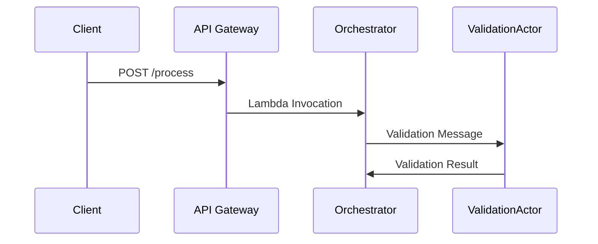
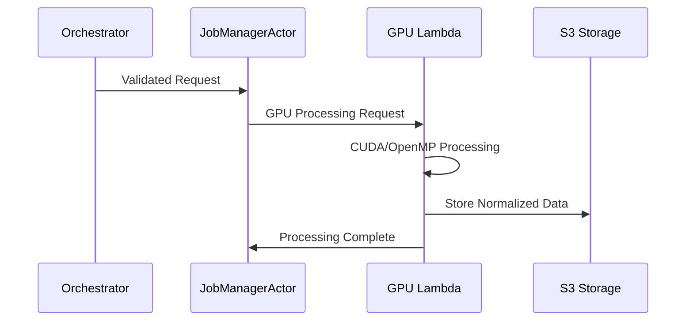
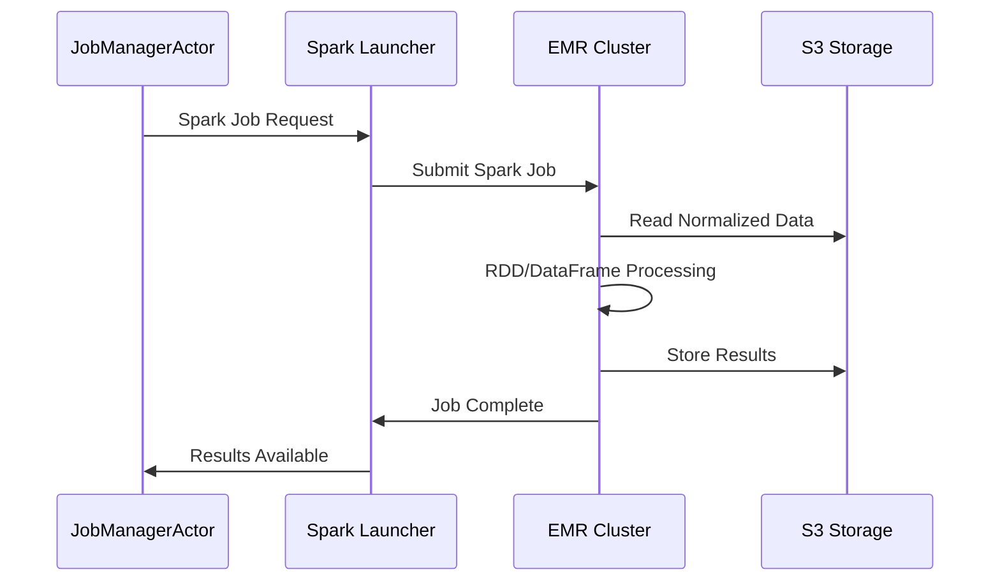
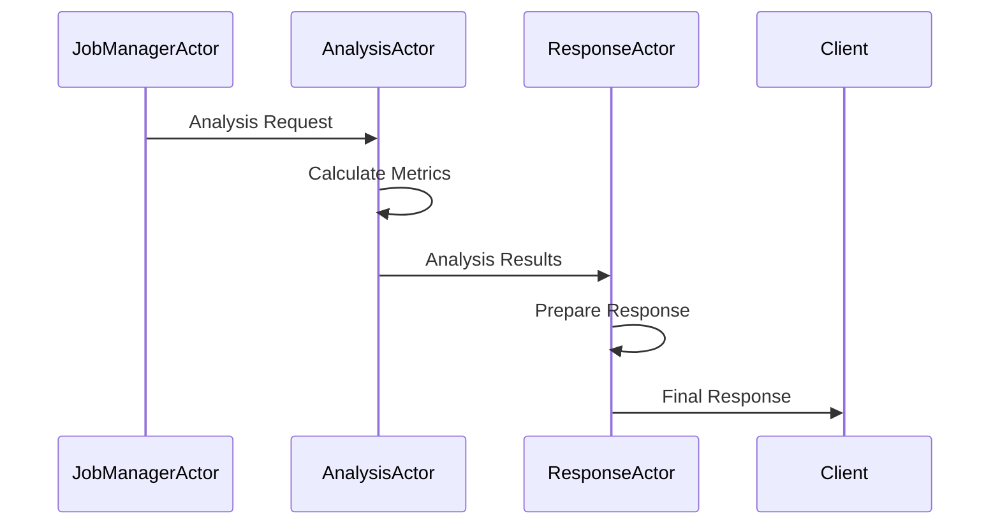

# Arquitectura del Sistema - Big-Data Processing Serverless

## Visión General

Este proyecto implementa una arquitectura híbrida de procesamiento Big-Data que combina tecnologías de GPU, Spark, y computación serverless en AWS. El sistema está diseñado para procesar grandes volúmenes de datos numéricos de manera eficiente y escalable.

## Arquitectura de Alto Nivel

```
┌─────────────────────────────────────────────────────────────────┐
│                        CLIENT LAYER                            │
│  ┌─────────────┐  ┌─────────────┐  ┌─────────────┐            │
│  │   Web App   │  │  Mobile App │  │   CLI Tool  │            │
│  └─────────────┘  └─────────────┘  └─────────────┘            │
└─────────────────────────────────────────────────────────────────┘
                                │
                                ▼
┌─────────────────────────────────────────────────────────────────┐
│                      API GATEWAY LAYER                         │
│  ┌─────────────────────────────────────────────────────────┐   │
│  │              AWS API Gateway                            │   │
│  │  • Rate Limiting                                       │   │
│  │  • Authentication                                      │   │
│  │  • CORS Support                                        │   │
│  └─────────────────────────────────────────────────────────┘   │
└─────────────────────────────────────────────────────────────────┘
                                │
                                ▼
┌─────────────────────────────────────────────────────────────────┐
│                    ORCHESTRATION LAYER                         │
│  ┌─────────────────────────────────────────────────────────┐   │
│  │              Actor System (Thespian)                   │   │
│  │  ┌─────────────┐ ┌─────────────┐ ┌─────────────┐      │   │
│  │  │Validation   │ │Job Manager  │ │Analysis     │      │   │
│  │  │Actor        │ │Actor        │ │Actor        │      │   │
│  │  └─────────────┘ └─────────────┘ └─────────────┘      │   │
│  │  ┌─────────────┐                                      │   │
│  │  │Response     │                                      │   │
│  │  │Actor        │                                      │   │
│  │  └─────────────┘                                      │   │
│  └─────────────────────────────────────────────────────────┘   │
└─────────────────────────────────────────────────────────────────┘
                                │
                                ▼
┌─────────────────────────────────────────────────────────────────┐
│                    PROCESSING LAYER                            │
│  ┌─────────────────────┐  ┌─────────────────────┐             │
│  │   GPU Processing    │  │   Spark Processing  │             │
│  │   (Lambda)          │  │   (EMR)             │             │
│  │  • CUDA/OpenMP      │  │  • RDD Pipeline     │             │
│  │  • Normalization    │  │  • DataFrame Pipeline│             │
│  │  • GPU Acceleration │  │  • Performance Metrics│            │
│  └─────────────────────┘  └─────────────────────┘             │
└─────────────────────────────────────────────────────────────────┘
                                │
                                ▼
┌─────────────────────────────────────────────────────────────────┐
│                      STORAGE LAYER                             │
│  ┌─────────────────────────────────────────────────────────┐   │
│  │                    AWS S3                               │   │
│  │  • Input Data Storage                                  │   │
│  │  • Intermediate Results                                │   │
│  │  • Final Results                                       │   │
│  │  • Analysis Reports                                    │   │
│  └─────────────────────────────────────────────────────────┘   │
└─────────────────────────────────────────────────────────────────┘
```

## Componentes Principales

### 1. API Gateway
- **Propósito**: Punto de entrada único para todas las solicitudes
- **Funcionalidades**:
  - Rate limiting y throttling
  - Autenticación y autorización
  - CORS support
  - Request/response transformation
- **Configuración**:
  - Regional endpoint
  - POST method para `/process`
  - OPTIONS method para CORS

### 2. Sistema de Actores (Thespian)
- **Propósito**: Orquestación y coordinación del flujo de procesamiento
- **Actores**:
  - **ValidationActor**: Valida datos de entrada y parámetros
  - **JobManagerActor**: Coordina GPU y Spark processing
  - **AnalysisActor**: Analiza resultados y calcula métricas
  - **ResponseActor**: Prepara respuesta final

#### Flujo de Mensajes
```
Client Request → ValidationActor → JobManagerActor → AnalysisActor → ResponseActor → Client
```

### 3. GPU Processing Lambda
- **Propósito**: Preprocesamiento de datos usando GPU
- **Tecnologías**:
  - CUDA para aceleración GPU
  - OpenMP para paralelización CPU
  - CuPy para operaciones numéricas
- **Funcionalidades**:
  - Normalización de datos
  - Cálculo de estadísticas básicas
  - Fallback a CPU si GPU no está disponible

### 4. Spark Processing (EMR)
- **Propósito**: Procesamiento distribuido de datos
- **Tecnologías**:
  - Apache Spark 3.4+
  - EMR Cluster (m5.xlarge instances)
  - YARN resource manager
- **Pipelines**:
  - **RDD Pipeline**: Procesamiento de bajo nivel
  - **DataFrame Pipeline**: Procesamiento optimizado

### 5. Almacenamiento S3
- **Propósito**: Almacenamiento persistente de datos y resultados
- **Estructura**:
  ```
  s3://bucket/
  ├── normalized_data/
  │   └── {job_id}/
  │       └── data.json
  ├── spark_results/
  │   └── {job_id}/
  │       ├── results.json
  │       └── final_results.json
  ├── gpu_results/
  │   └── {job_id}/
  │       └── results.json
  └── analysis_results/
      └── {job_id}/
          └── analysis.json
  ```

## Flujo de Procesamiento

### 1. Recepción de Solicitud


### 2. Procesamiento GPU


### 3. Procesamiento Spark


### 4. Análisis y Respuesta


## Configuración de Infraestructura

### Lambda Functions
- **Orchestrator**: 1024MB RAM, 15min timeout
- **GPU Processing**: 2048MB RAM, 5min timeout
- **Spark Launcher**: 1024MB RAM, 15min timeout

### EMR Cluster
- **Master Node**: m5.xlarge
- **Core Nodes**: 2x m5.xlarge
- **Applications**: Spark, Hadoop, Hive
- **Release**: EMR 6.15.0

### S3 Bucket
- **Versioning**: Enabled
- **Encryption**: SSE-S3
- **Lifecycle**: 30 days retention

## Consideraciones de Escalabilidad

### Escalabilidad Horizontal
- **Lambda**: Escalado automático basado en demanda
- **EMR**: Auto-scaling groups para core nodes
- **API Gateway**: Rate limiting configurable

### Escalabilidad Vertical
- **Lambda Memory**: Configurable (128MB - 10GB)
- **EMR Instance Types**: Escalable según carga
- **GPU Instances**: P3/P3dn para GPU processing

## Monitoreo y Observabilidad

### CloudWatch Metrics
- **Lambda**: Invocations, duration, errors
- **EMR**: Cluster metrics, step completion
- **API Gateway**: Request count, latency, 4xx/5xx errors

### Logs
- **Lambda Logs**: Structured logging con AWS Lambda Powertools
- **EMR Logs**: Spark application logs
- **Application Logs**: Actor system logs

### Alertas
- **Error Rate**: > 5% error rate
- **Latency**: > 30s response time
- **Cost**: > $10/day threshold

## Seguridad

### IAM Roles y Políticas
- **Least Privilege**: Acceso mínimo necesario
- **Lambda Role**: S3, EMR, Lambda invoke permissions
- **EMR Role**: S3, EC2 permissions

### Encriptación
- **Data in Transit**: TLS 1.2+
- **Data at Rest**: S3 SSE-S3 encryption
- **Lambda Environment**: Variables encriptadas

### Network Security
- **VPC**: EMR cluster en VPC privada
- **Security Groups**: Acceso restringido
- **API Gateway**: WAF integration disponible

## Optimizaciones de Rendimiento

### GPU Optimizations
- **Memory Management**: CuPy memory pools
- **Batch Processing**: Procesamiento por lotes
- **Fallback Strategy**: CPU fallback automático

### Spark Optimizations
- **Partitioning**: Particionado óptimo de datos
- **Caching**: Cache de DataFrames frecuentemente usados
- **Broadcast Variables**: Variables pequeñas broadcast

### Lambda Optimizations
- **Cold Start**: Provisioned concurrency
- **Memory**: Optimización de memoria vs CPU
- **Dependencies**: Minimización de package size

## Costos Estimados

### Lambda Costs
- **Orchestrator**: ~$0.0001 per invocation
- **GPU Processing**: ~$0.0002 per invocation
- **Spark Launcher**: ~$0.0001 per invocation

### EMR Costs
- **Cluster**: ~$0.27/hour per m5.xlarge
- **Data Transfer**: ~$0.09/GB outbound

### S3 Costs
- **Storage**: ~$0.023/GB/month
- **Requests**: ~$0.0004 per 1000 requests

### Total Estimated Cost
- **Small Dataset (1K records)**: ~$0.50
- **Medium Dataset (100K records)**: ~$2.00
- **Large Dataset (1M records)**: ~$15.00

## Limitaciones y Consideraciones

### Limitaciones Técnicas
- **Lambda Timeout**: Máximo 15 minutos
- **GPU Memory**: Limitado por instancia Lambda
- **EMR Startup**: 5-10 minutos para cluster

### Limitaciones de Negocio
- **Data Size**: Máximo 1M elementos por request
- **Concurrency**: Rate limiting en API Gateway
- **Cost**: EMR clusters incurren costos continuos

### Consideraciones de Diseño
- **Idempotency**: Requests pueden ser reprocesados
- **Fault Tolerance**: Retry logic en todos los componentes
- **Data Consistency**: Eventual consistency en S3
